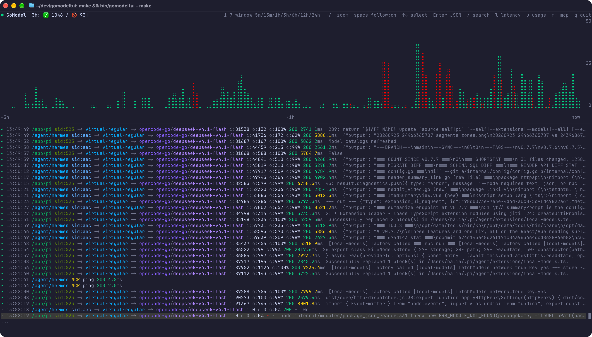
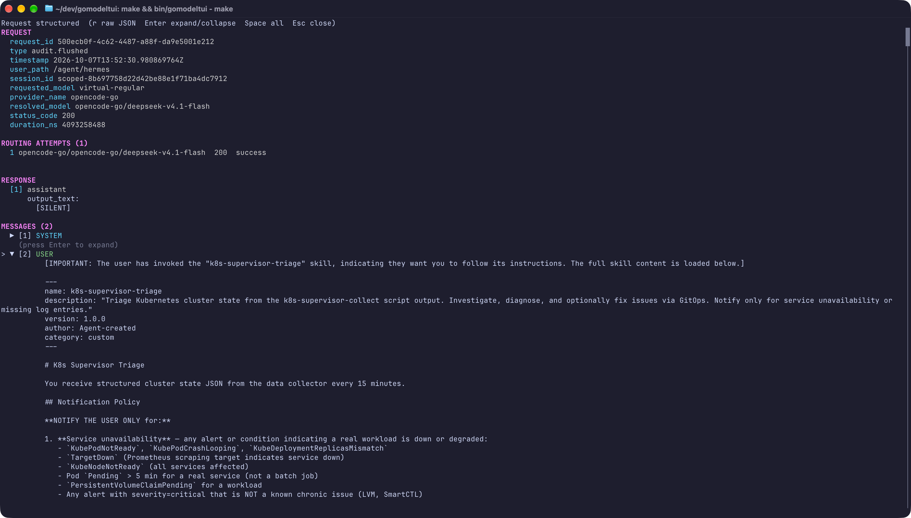
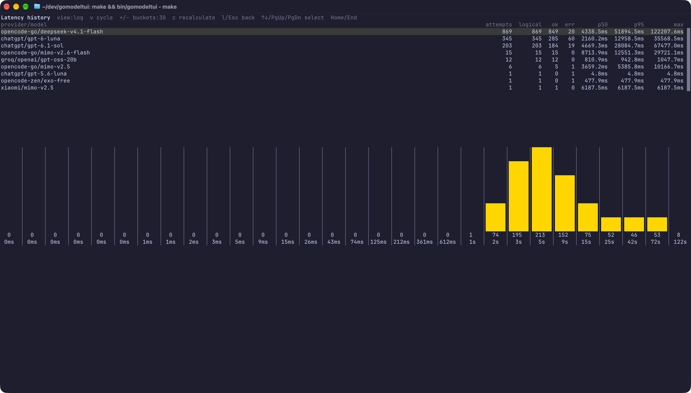

# gomodeltui

> [!WARNING]
> **This application was fully vibe-coded. No human has ever reviewed the
> source code.** It has not been audited for correctness, security, or
> safety. Use it at your own risk — do not treat it as reviewed or trusted
> software, and review the code yourself before relying on it.

[](https://github.com/a-bali/gomodeltui/actions/workflows/ci.yml)
[](https://github.com/a-bali/gomodeltui/releases)
[](go.mod)
[](LICENSE)

A read-only terminal UI for GoModel request activity, live audit logs, latency
statistics, MCP traffic, and provider quotas. `gomodeltui` streams the GoModel
admin audit log, backfills recent history, and renders everything in a single
terminal window — without writing to your GoModel instance or changing any
provider account state.

## Screenshots

### Live activity and request log



The default screen pairs a btop-style Braille activity chart with the live
request log. Use `1`–`7` to switch between 5-minute and 24-hour windows. Each
log row shows the outcome, timestamp, path, session, client and routed model,
input/output tokens, cache ratio, HTTP status, duration, and a preview of the
last conversation turn.

### Request details



Press `Enter` on a log row to inspect a request. The structured view shows
request metadata, every routing attempt (including failovers and error codes),
the response body, and the conversation messages. Toggle raw JSON with `r`, and
expand or collapse individual messages with `Enter` or `Space`.

### Latency history



Press `l` for per provider/model latency statistics — attempts, logical
requests, successes, errors, p50, p95, and max — with a histogram of the
selected model. Cycle between linear, logarithmic, and p99 + overflow
distributions with `v`, and adjust the bucket count with `+`/`-`.

## Features

- **Live audit stream** over Server-Sent Events, with automatic reconnect and
  `Last-Event-ID` resume so no completed request is missed during a blip.
- **History backfill** from the GoModel audit log API on startup and after
  reconnects.
- **Activity chart** rendered with Braille glyphs, seven zoom windows, and
  success/error colouring.
- **Request log** with route, session, token, cache, status, and latency
  columns, full-text search, follow mode, and a scrollbar.
- **Request inspector** with structured and raw JSON views, routing-attempt
  details, prompt/response message expansion, and lazy loading of omitted
  bodies from the audit detail endpoint.
- **Latency analytics** per provider/model with p50/p95/max and switchable
  histogram distributions.
- **MCP statistics** for JSON-RPC methods and tools, kept separate from model
  traffic so MCP calls never skew model metrics.
- **Provider quotas** for OpenCode Go, Command Code, and ChatGPT / Codex, with
  progress bars and reset countdowns.
- **Flexible configuration** via YAML, environment variables, and flags, with a
  documented [sample file](config.example.yaml).
- **Read-only by design**: credentials are read from local files or environment
  variables and are never written, refreshed, or transmitted anywhere except
  the provider endpoint that issued them.

## Requirements

- A reachable GoModel instance with an admin API key that can read
  `/admin/live/logs`, `/admin/audit/log`, and `/admin/audit/detail`.
- A terminal with 256-colour or truecolour support.
- Go 1.23 or newer to build from source (or the provided Nix dev shell).

## Installation

### Prebuilt binaries

Download the archive for your platform from the
[releases page](https://github.com/a-bali/gomodeltui/releases), extract it, and
put `gomodeltui` on your `PATH`. Archives are published for Linux, macOS, and
Windows on `amd64` and `arm64`.

### With the Go toolchain

```sh
go install github.com/a-bali/gomodeltui/cmd/gomodeltui@latest
```

### From source

```sh
git clone https://github.com/a-bali/gomodeltui.git
cd gomodeltui
make build        # produces bin/gomodeltui
```

The repository ships a Nix flake with Go, `gopls`, and `golangci-lint`:

```sh
nix develop
make build
```

## Quick start

Set the required GoModel API key and run the TUI:

```sh
export GOMODEL_URL=http://localhost:8080
export GOMODEL_API_KEY=your-gomodel-api-key
gomodeltui
```

The header always shows the active keybindings, and `q` (or `Ctrl+C`) quits.
To monitor provider quotas, press `u`; for latency press `l`; for MCP methods
press `m`.

## Configuration

Configuration is merged from three sources. Later sources override earlier
ones:

1. **YAML file** — `~/.config/gomodeltui/config.yaml`, or
   `$XDG_CONFIG_HOME/gomodeltui/config.yaml`. Select another file with
   `--config /path/to/config.yaml` or the `GOMODELTUI_CONFIG` environment
   variable.
2. **Environment variables** — see the table below.
3. **Command-line flags** — see `gomodeltui --help`.

Start from [`config.example.yaml`](config.example.yaml):

```sh
mkdir -p ~/.config/gomodeltui
cp config.example.yaml ~/.config/gomodeltui/config.yaml
chmod 600 ~/.config/gomodeltui/config.yaml
$EDITOR ~/.config/gomodeltui/config.yaml
```

A minimal file looks like this:

```yaml
log_retention: 24h

gomodel:
  url: http://localhost:8080
  api_key: your-gomodel-api-key

providers:
  opencode:
    api_key: your-opencode-api-key
  commandcode:
    cookie: "__Secure-commandcode_prod_.session_token=…"
  codex:
    auth_path: ~/.codex/auth.json
```

### Configuration keys

Every dotted key is available in all three sources:

| YAML key | Environment variable | Flag |
| --- | --- | --- |
| `log_retention` | `LOG_RETENTION` | `--log_retention` |
| `gomodel.url` | `GOMODEL_URL` | `--gomodel.url` |
| `gomodel.api_key` | `GOMODEL_API_KEY` | `--gomodel.api_key` |
| `providers.opencode.api_key` | `PROVIDERS_OPENCODE_API_KEY` | `--providers.opencode.api_key` |
| `providers.commandcode.cookie` | `PROVIDERS_COMMANDCODE_COOKIE` | `--providers.commandcode.cookie` |
| `providers.codex.auth_path` | `PROVIDERS_CODEX_AUTH_PATH` | `--providers.codex.auth_path` |

File selection uses `GOMODELTUI_CONFIG` or `--config PATH`. Unknown YAML keys
are rejected so typos fail fast.

### Retention

`log_retention` controls how long completed requests stay in the TUI's
in-memory history; it defaults to `24h` and accepts any positive Go duration
(`30m`, `6h`, `24h`, …). Startup backfill loads the most recent hour;
`log_retention` only bounds what the UI keeps while running. Nothing is written
to disk.

### Security

The YAML file can contain credentials. Restrict it to its owner:

```sh
chmod 600 ~/.config/gomodeltui/config.yaml
```

Environment variables are a good alternative when you do not want secrets on
disk.

## Keybindings

### Main screen

| Key | Action |
| --- | --- |
| `1` … `7` | Time window: 5m, 15m, 1h, 3h, 6h, 12h, 24h |
| `+` / `=` | Zoom in (shorter window) |
| `-` | Zoom out (longer window) |
| `space` | Toggle follow mode |
| `↑` / `↓` | Move selection |
| `PgUp` / `PgDn` | Move selection by a page |
| `Home` / `End` | Jump to oldest / newest |
| `g` | Resume following the newest request |
| `/` | Search; `n` jumps to the next match |
| `Enter` | Open the selected request |
| `c` | Clear retained history |
| `r` | Reconnect the live stream |
| `l` | Latency screen |
| `u` | Provider usage screen |
| `m` | MCP methods screen |
| `q` / `Ctrl+C` | Quit |

### Request detail

| Key | Action |
| --- | --- |
| `r` | Toggle structured / raw JSON |
| `Enter`, `←`, `→` | Expand or collapse the focused message |
| `space` | Expand or collapse all messages |
| `↑` / `↓`, `PgUp` / `PgDn` | Scroll |
| `Home` / `End` | Jump to start / end |
| `Esc` | Close |

### Latency screen

| Key | Action |
| --- | --- |
| `v` | Cycle histogram view: linear, log, p99 + overflow |
| `+` / `=` | Increase bucket count |
| `-` | Decrease bucket count |
| `c` | Recalculate the shared histogram scale |
| `↑` / `↓`, `PgUp` / `PgDn` | Change selected model |
| `Home` / `End` | First / last model |
| `l` / `Esc` | Back |

### Usage and MCP screens

| Key | Action |
| --- | --- |
| `r` | Refresh quotas (usage screen only) |
| `↑` / `↓`, `PgUp` / `PgDn` | Scroll (MCP screen) |
| `Home` / `End` | Jump to start / end (MCP screen) |
| `u` / `m` / `Esc` | Back to the main screen |

## Provider usage

Press `u` to view quotas for accounts available on this machine. The screen
refreshes every minute, and `r` refreshes it immediately. A provider is shown
only when its credential is available:

- **ChatGPT / Codex** — the local `~/.codex/auth.json` sign-in, or
  `providers.codex.auth_path`.
- **OpenCode Go** — `providers.opencode.api_key`.
- **Command Code** — `providers.commandcode.cookie`.

Credentials are read only. `gomodeltui` never writes them to disk and never
modifies account state.

## How it works

`gomodeltui` talks to the GoModel admin API:

- `/admin/live/logs` — Server-Sent Events stream of in-flight and completed
  requests, resumed with `Last-Event-ID`.
- `/admin/audit/log` — paginated, persisted audit entries used for backfill.
- `/admin/audit/detail` — full audit entry, fetched lazily when the stream
  omits large request or response bodies.

Events are reduced into logical requests, split into per-attempt rows when a
request failed over between providers, and fed into the activity chart, latency
store, and MCP statistics. All state lives in memory and is pruned according to
`log_retention`.

## Development

```sh
nix develop          # provides Go, gopls, and golangci-lint
make build           # build bin/gomodeltui
make test            # go test ./...
make test-race       # go test -race ./...
make vet             # go vet ./...
make fmt-check       # verify gofmt
make run             # run without building
make snapshot        # local GoReleaser snapshot
```

A single package can be tested directly, for example:

```sh
go test ./internal/ui -run TestMCP
```

There is also an opt-in integration smoke test that requires a live GoModel
instance:

```sh
GOMODEL_URL=http://localhost:8080 GOMODEL_API_KEY=... \
  go test -tags integration ./internal/ui -run TestRemoteLiveChartSmoke
```

Releases are cut by pushing a `v*` tag; the release workflow runs GoReleaser
and publishes archives and checksums to GitHub Releases.

## License

Released under the [GNU Affero General Public License v3.0](LICENSE).
